<picture>
  <source media="(prefers-color-scheme: dark)" srcset="assets/banner-dark.svg">
  
</picture>

I like owning the whole thing: the idea, the interface, the backend, the deploy, and the tooling that makes the next one faster. Most of that happens at **[Tielemans Software](https://tielemans.dev)**, alongside a Computer Science degree in Aalborg.

### Selected work

<a href="https://github.com/MartinPTielemans/t3-fleet">
  <picture>
    <source media="(prefers-color-scheme: dark)" srcset="assets/t3-fleet-dark.svg">
    
  </picture>
</a>

<a href="https://github.com/tielemans-dev/quits-oss"><picture><source media="(prefers-color-scheme: dark)" srcset="assets/quits-dark.svg"></picture></a>&nbsp;<a href="https://github.com/MartinPTielemans/PackSwitcher"><picture><source media="(prefers-color-scheme: dark)" srcset="assets/packswitcher-dark.svg"></picture></a>

### Stack

### Find me

[tielemans.dev](https://tielemans.dev) · [Tielemans Software on GitHub](https://github.com/tielemans-dev)
