<picture>
  <source media="(prefers-color-scheme: dark)" srcset="assets/banner-dark.svg">
  
</picture>

Hi, I'm Martin. Full-stack developer and Computer Science student in Aalborg, Denmark. I run **[Tielemans Software](https://tielemans.dev)**, where I build and ship small products end to end: the web app, the native iOS app, and the tooling around them.

#### Right now

- Shipping products under Tielemans Software, from idea to paying customer
- Building native iOS apps in Swift and SwiftUI
- Working on AI agent tooling: MCP servers and running coding agents across machines

#### Stack

#### Find me

